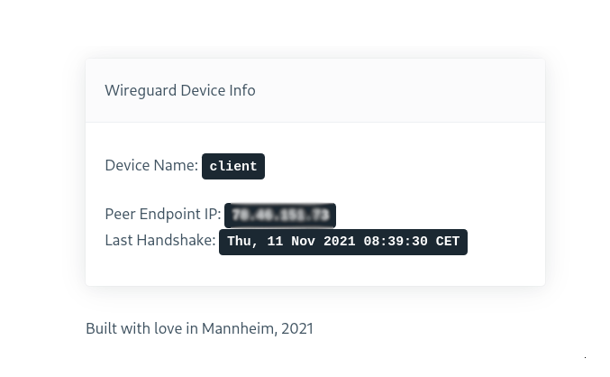

# Wireguard Dashboard

This project is a playground to learn more about alpine.js, embedding files in go binaries and using go-gin as a web framework.



## What this program does

Uses the wireguard client to retrieve all active wireguard devices and exposes them via a REST API available at `/info`.

Provides a frontend, written in alpine.js (thanks for the help [@andaryjo](https://github.com/andaryjo)) and plain html which is available at `/dashboard`. Those html files are embedded in the final go binary.

## Environment Variables

```bash
WG_EXTERNAL_URL="http://localhost:3001"
WG_BIND_ADDRESS="localhost:3001"
```

## Development Setup

I'm using [air](https://github.com/cosmtrek/air) for the automatic reload upon changes.

To start the app:

```bash
sudo air
```

The app is then available at `localhost:3001`. (when using defaults)
